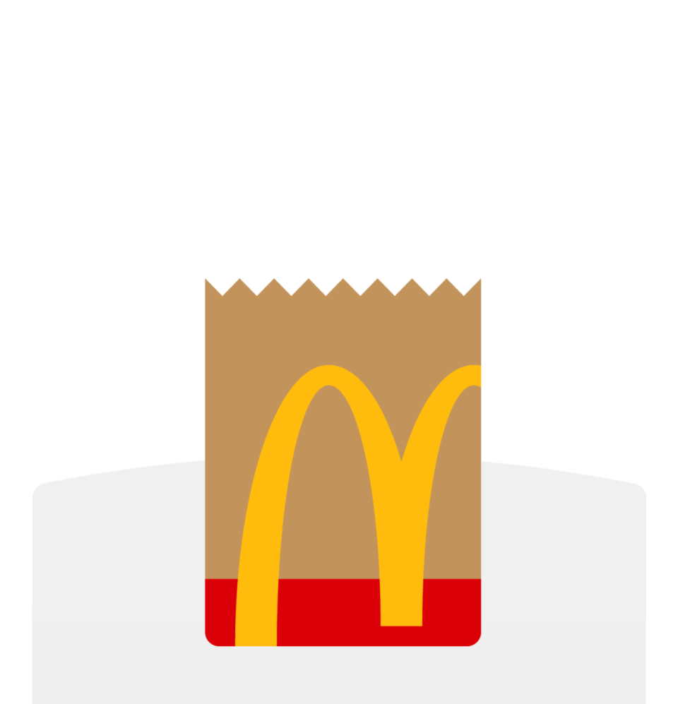

# 
 <u>TPE Seminario Angular</u> 

## 
 **McDonalds App** 

  

## 📋 **Desarrollador**
  * [Ailen Peralta Amado][websiteA]

## 🔎 **Informacion Personal**
  * *DNI:* 43512851
  * *Email:* [ailen_peralta_24@outlook.com](ailen_peralta_24@outlook.com)
  * *Sede:* Tandil

## 📖 **Descripción**
*No sabes que comer❓*  
*No tienes ganas de cocinar❓*  
**McDonalds-App es tu pagina ideal**❗ 
Donde puedes realizar tu pedido de forma rapida y sencilla.⏳  
Selecciona la hamburguesa que deseas consumir, agrega una bebida, un acompañamiento y un postre.😋  
Solo debes: 
  * Agregar estos productos a tu carrito. 🛒
  * Indica si queres recibirlo en tu hogar o retirarlo en la sucursar mas cercana. 🚀
  * Realiza el pedido. 👩‍💻

  

**
 Y Listo, disfruta tu comida favorita✅ 
**

[websiteA]: https://github.com/2Ailu4

